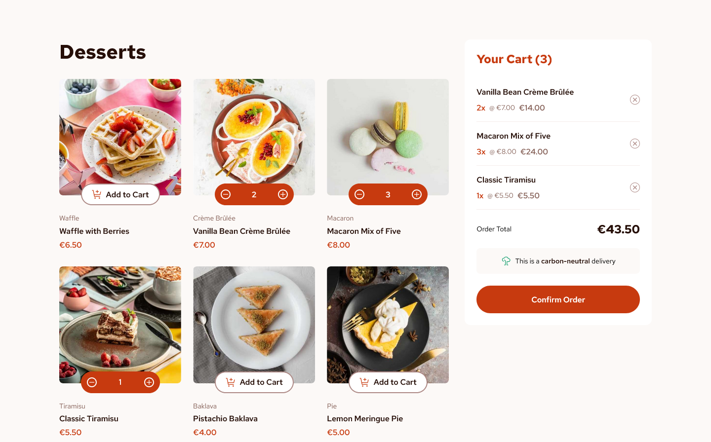

# Frontend Mentor - Product list with cart solution

This is a solution to the
[Product list with cart challenge on Frontend Mentor](https://www.frontendmentor.io/challenges/product-list-with-cart-5MmqLVAp_d).
Frontend Mentor challenges help me improve my coding skills by building realistic projects.

## Table of contents

- [Overview](#overview)
  - [The challenge](#the-challenge)
  - [Screenshot](#screenshot)
  - [Links](#links)
- [My process](#my-process)
  - [Built with](#built-with)
  - [What I learned](#what-i-learned)
  - [Continued development](#continued-development)
- [Author](#author)

## Overview

### The challenge

Users should be able to:

- Add items to the cart and remove them
- Increase/decrease the number of items in the cart
- See an order confirmation modal when they click "Confirm Order"
- Reset their selections when they click "Start New Order"
- View the optimal layout for the interface depending on their device's screen size
- See hover and focus states for all interactive elements on the page

### Screenshot

### Links

- Solution URL: [Add solution URL here](https://your-solution-url.com)
- Live Site URL: [Live Demo](https://product-list-with-cart-alpha.vercel.app/)

## My process

### Built with

- Semantic HTML5 markup
- Flexbox
- CSS Grid
- Mobile-first workflow
- [React](https://react.dev) - JS library
- [TypeScript](https://reactjs.org/) - Type Checking
- [Taiwindcss](https://tailwindcss.com) - For styles
- [Zustand](https://docs.pmnd.rs/zustand/getting-started/introduction) - State Management

### What I learned

This project was my first experience using Zustand for state management. Zustand is a lightweight
and intuitive state-management library for React applications. It simplifies state management
compared to more complex solutions like Redux.

### Continued development

Moving forward, there are several areas I plan to focus on to enhance my skills and improve the
project:

1. Advanced Zustand Patterns

- Selectors and Computed States: Explore using selectors for more efficient state access and
  computed states to derive values from the store.
- Middleware: Implement middleware for logging, persistence, and other side effects.

2. Testing

- Unit Testing: Write unit tests for the Zustand store to ensure state management logic is robust
  and error-free.
- Integration Testing: Conduct integration tests to verify the interaction between components and
  the Zustand store.

## Author

- Website - [Sergejs Ivcenko](https://sergejs-ivcenko.netlify.app)
- Frontend Mentor - [@Sergio0831](https://www.frontendmentor.io/profile/Sergio0831)
- GitHub - [Sergio0831](https://github.com/Sergio0831)
